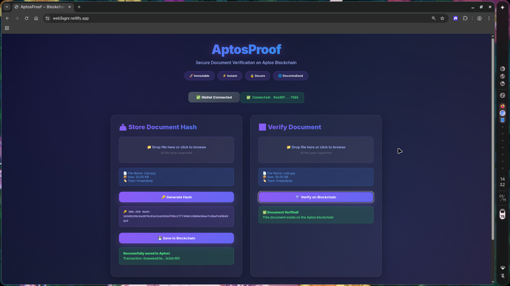
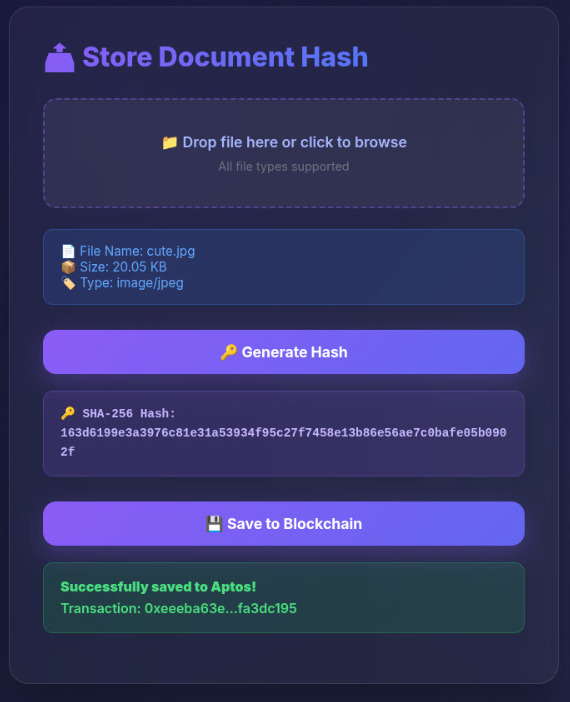
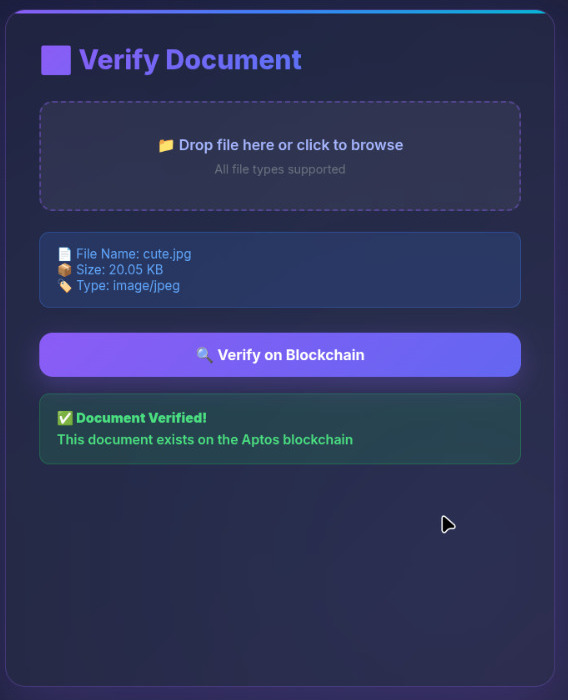
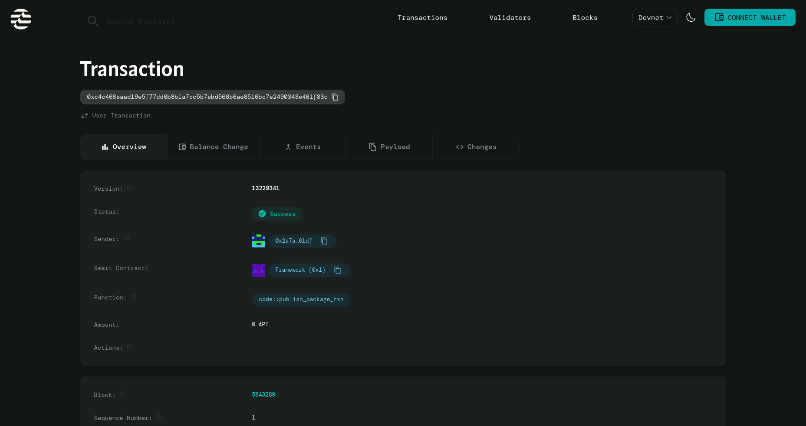

# AptosProof — Blockchain Document Verification

Secure, Immutable, Decentralized Document Authentication on Aptos Blockchain

# Overview

AptosProof is a decentralized document verification system that stores cryptographic hashes of documents on the Aptos blockchain. It provides immutable proof of existence and allows verification at any time.

Core Highlights

Immutable — Stored hashes cannot be changed
Fast — Powered by Aptos high-throughput network
Decentralized — No central control
Secure — SHA-256 based integrity protection
Simple — Minimal user interface, wallet integrated

# Features

Main Functions

Document hash generation (SHA-256)

On-chain hash storage

File verification and proof retrieval

Petra Wallet connection

## Project Tree

```
AptosProof/
├── frontend/
│   ├── index.html
│   ├── style.css
│   ├── script.js
│   └── utils/
│       ├── aptosClient.js
│       └── hashUtils.js
├── move/
│   └── sources/
│       └── DocumentStore.move
├── scripts/
│   └── deploy_move_contract.sh
├── .aptos/
│   └── config.yaml
├── run.sh
├── README.md
└── TROUBLESHOOTING.md
```

---

## Screenshots

**1. Dashboard**



**2. Store Document Hash**



**3. Verify Document & Transaction Confirmation**



---

# Contract Address

0x1b4f9f57c1525220fe12d508291a670f4aa9330aa650dfa37d9e7c065a2006fb



---

**Summary**
AptosProof is a decentralized system for document authentication using the Aptos blockchain. It generates SHA-256 hashes of documents and stores them immutably on-chain, allowing later verification of authenticity without centralized databases. Built with a minimal HTML, CSS, and JavaScript frontend and a Move smart contract backend, it ensures immutability, transparency, and cryptographic integrity.

---
